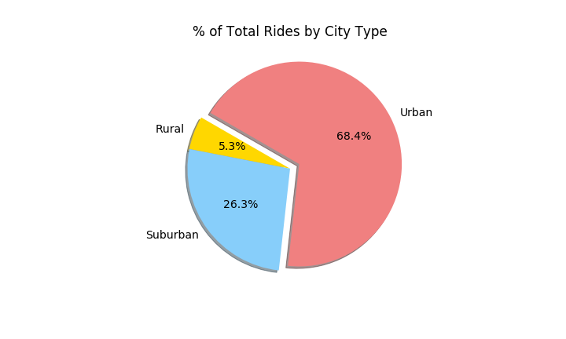
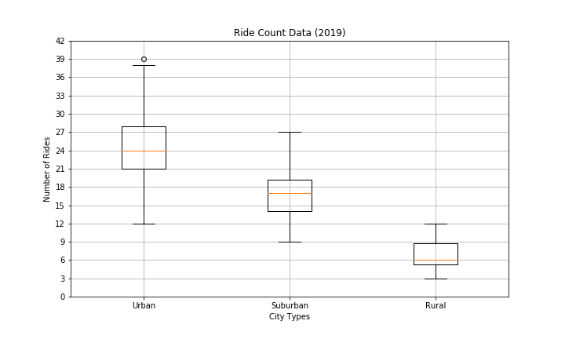
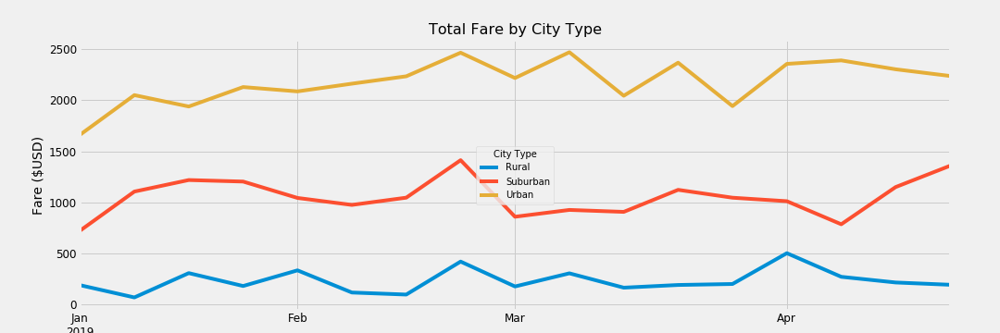

# PyBer_Analysis
## Project Goals
PyBer is a ride-sharing app company.  The goal of the project is to gain an in-depth look into the ridership and fares across Urban, Suburban, and Rural cities.
## Data Sources
1. City data containing City, Driver Count, and City Type
2. Individual ride data collected between 1/1/2019 and 5/8/2019, containing City, Date, Fare, and Ride ID.
## Methodology
Using VS Code and Jupyter Notebook to merge data set, create new DataFrames to summarize data, and graph data using matplotlib.

## Challenge Findings
### Summary Ride Data Findings:  Data from 1/1/2019 to 4/28/2019 only
- **Total Rides**  (Rural 125, Suburban 625, Urban 1,625):
     - Urban cities are the biggest market for PyBer, accounting for 68.4% of the total rides.  In contrast, rural cities have significantly lower ride counts compared to Urban cities.  As supported by the box-and-whisker graph that includes data through 5/8/2019, the upper limit of the rural city ride count is around the lower limit of the urban city ride count, suggesting a very different ride count distribution between Urban and Rural cities.

     
- **Total Drivers**  (Rural 78, Suburban 490, Urban 2,405):  Urban cities drivers account for 80.9% of the PyBer Drivers.  The usage of PyBer service is much lower in Rural cities.  Thus, the data shows much smaller driver counts in Rural cities as well, which may in turn contribute to the lower usage of the service.
- **Total Fares**  (Rural $4,327.93, Suburban $19,356.33, Urban $39,854.38):  With the largest ridership and number of drivers in Urban cities, this market generates the most fares among the three city types. Suburban market is about half of the Urban market, and Rural is about tenth of the Urban market in terms of fares generaged.
- **Average Fare per Ride**  (Rural $34.62, Suburban $30.97, Urban $24.53): Although Rural cities are the smallest market, it has the highest average fare per ride, and approx. $10 higher per ride compared to Urban cities.  This might be due to longer travel distance in rural cities, which we could possibly examine later with addtional travel distance data.  However, with such lower ridership in Rural cities, this higher average fare likely has minimal impact on the overall revenue.  In contrast, Urban cities have the lowest average fare per ride among three city types.  This is also understandable because travel distances are likely to be less in Urban cities.  
- **Average Fare per Driver**  (Rural $55.49, Suburban $39.50, Urban $16.57): The high average fare per rural driver is likely due to the fact that there are less PyBer drivers in rural cities and longer travel distances.
- Overall, Urban cities are where the most PyBer businesses concentrated currently, with more drivers and ridership.  There's a potential growth opportunity in the rural cities where driver could generate higher fare per ride, but nevertheless a more challenging market with low usage for the PyBer app.

### Time-series analysis
   
   
- The line graph above summarizes the total fare weekly from January to April in 2019 (each week ends on Sunday).  The overall trends from the three city types seemed similar with minute differences in certain points in the time series.
-  The weekly total fare for the three city types remained at different ranges in the time-series, and did not overlap at any point in time.
      -  For the Rural cities, the total fare stayed within the range of $0 to $500 in the four-month period.
      -  For the Suburban cities, the total fare stayed approximately in the range between $750 and $1500 in the four-month period.
      -  For the Urban cities, the total fare stayed above $1660 but below $2500 in the four-month period.
- The total fare for Urban and Suburban cities increased at the second week of January, while it decreased for Rural cities at the second week of January.
- Urban and Suburban showed a peak in total fare in the week ending 2/24/2019.  Rural also showed a peak in the week ending 2/24/2019, but Rural's highest total fare came in the first week of April.
- Suburban fare showed an increase toward the end of April, but this increase is within the overall range of fluctuations between January and April.
